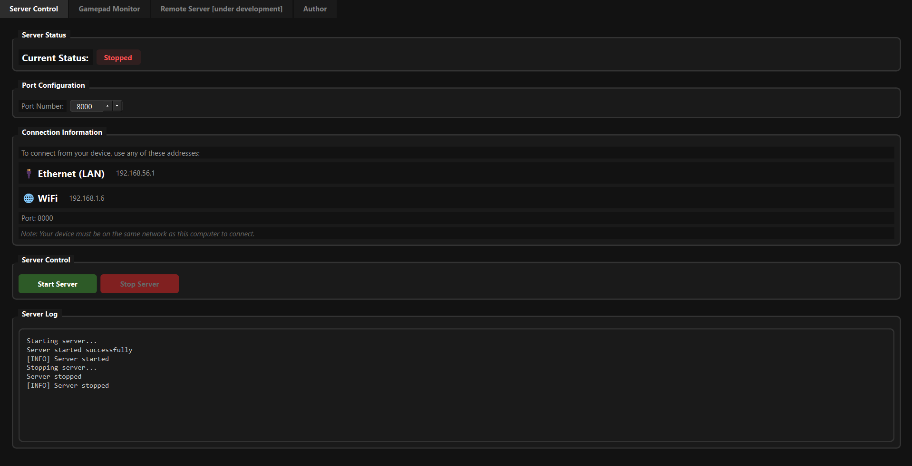
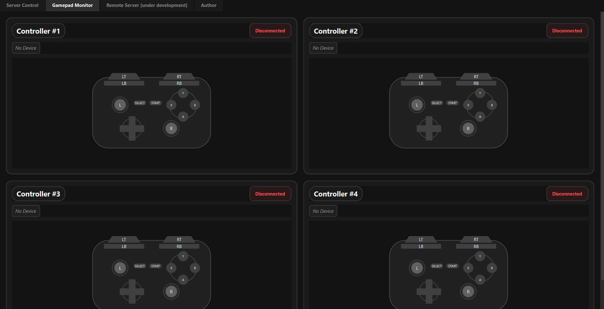

# BuanaVPad PC - Virtual Gamepad Server

BuanaVPad is a desktop application that allows you to use your mobile phone as a virtual gamepad controller. It creates a server that connects your mobile device to your PC, enabling gamepad input simulation.

## Features
- Easy-to-use server control interface
- Real-time gamepad input monitoring
- Support for multiple controllers (up to 4 controllers)
- Cross-platform connectivity via local network
- Button testing and monitoring interface
- Remote server capability (Coming Soon! 🚧)

## Getting Started

### Installation
1. Download the latest BuanaVPad-Setup.exe from [Releases](https://ristek.link/buana-vpad-windows)
2. Run the installer and follow the installation wizard
3. Launch BuanaVPad from your desktop or start menu

### Basic Usage

#### Setting Up the Server

1. Launch BuanaVPad desktop application

2. Go to "Server Control" tab

3. The default port is 8000 (you can change it if needed)
4. Click "Start Server" to begin listening for connections
5. Note down the connection information shown:
   - Either Ethernet (LAN) IP: (e.g., 192.168.56.1)
   - Or WiFi IP: (e.g., 192.168.1.6)
   - Port: 8000

#### Connecting Your Mobile Device
1. Ensure your mobile device is on the same network as your PC
2. Install BuanaVPad Mobile on your phone
3. Enter the server IP and port shown in the desktop app
4. Connect to start using your phone as a gamepad

#### Monitoring Connections
1. Switch to the "Gamepad Monitor" tab
2. You can monitor up to 4 controllers:
   - Controller #1
   - Controller #2
   - Controller #3
   - Controller #4
3. Each controller shows:
   - Connection status (Connected/Disconnected)
   - Real-time button states
   - Visual representation of gamepad layout

## Network Requirements
- Your mobile device must be on the same local network as the PC
- Firewall may need to be configured to allow connections on port 8000
- Supports both WiFi and Ethernet connections

## Troubleshooting

### Can't Connect?
1. Make sure server shows "Started" status in green
2. Verify both devices are on the same network
3. Try both IP addresses provided (Ethernet and WiFi)
4. Check your firewall settings
5. Make sure port 8000 or port that you chosen is not being used by another application

### Lost Connection?
- Try stopping and restarting the server
- Reconnect from the mobile app
- Check your network stability

## Coming Soon
- Remote Server functionality for non-local connections
- More controller customization options
- Advanced mapping features

## Support
For issues and updates, visit our [GitHub repository](https://github.com/isaui/buana-vpad).

## License
Released under the MIT License.

Made with ❤️ by Isa Citra Buana

