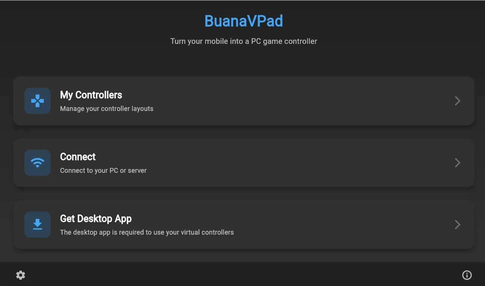
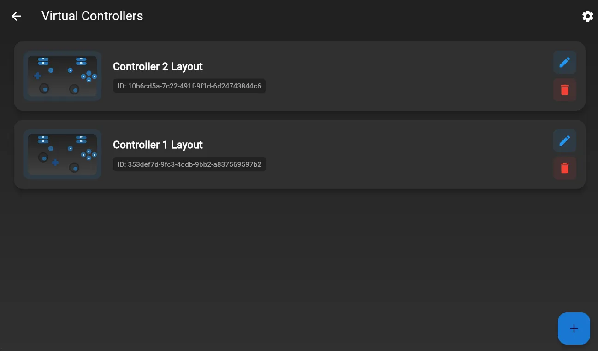
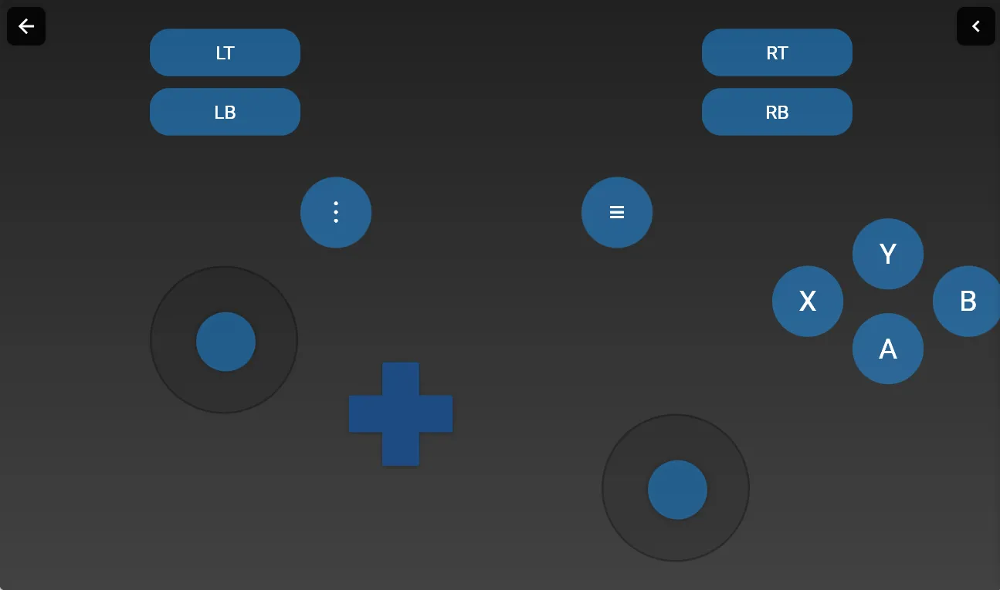
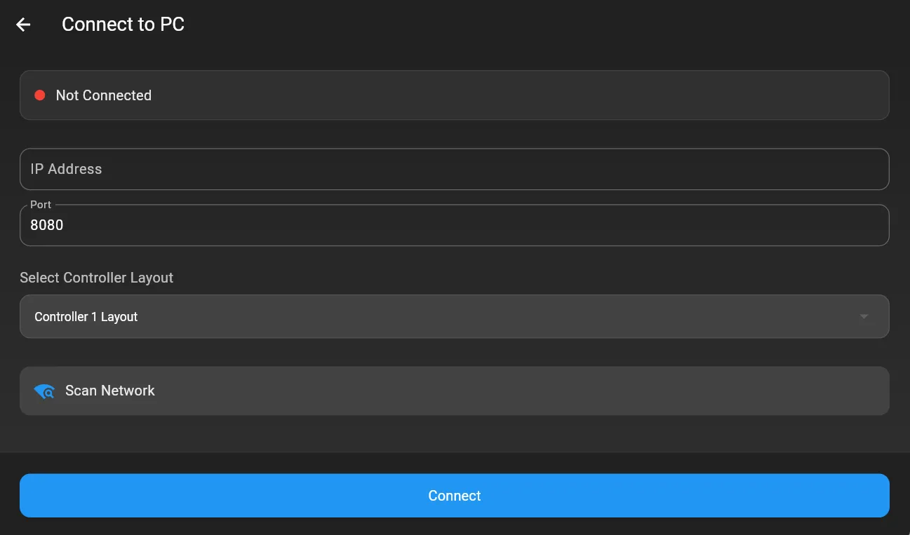
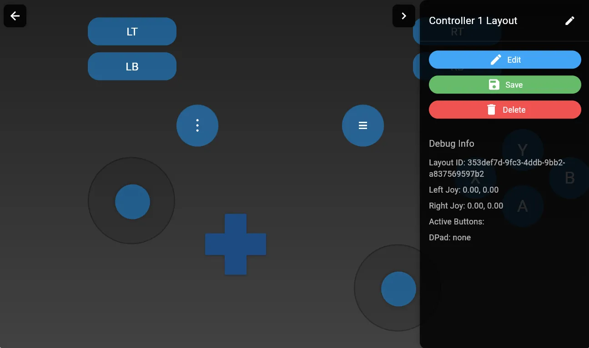
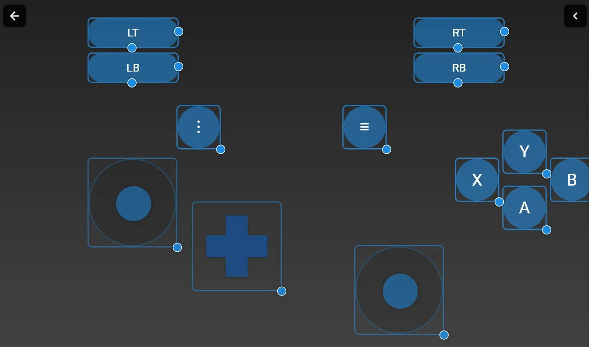

# BuanaVPad

BuanaVPad is a mobile application that allows you to turn your smartphone into a PC game controller. With BuanaVPad, you can use your mobile device as a virtual gamepad for playing games on your PC.

# Mobile Application Documentation

BuanaVPad is a mobile application that allows you to turn your smartphone into a PC game controller. With BuanaVPad, you can use your mobile device as a virtual gamepad for playing games on your PC.

## Features

- Multiple controller layout support
- Customizable Layout
- Easy PC connection via WiFi and Remote Server
- Real-time input feedback
- Debug information display
- Save and load controller configurations

## Installation

1. Download and install the BuanaVPad mobile app on your smartphone
2. Download and install the BuanaVPad desktop application on your PC
3. Ensure both devices are connected to the same network

## Usage Guide

### Setting Up Your Controller

1. Launch the BuanaVPad app on your mobile device
2. From the main menu, tap "My Controllers" to manage your controller layouts
3. You can create a new layout or select from existing ones
4. Each layout can be customized with:
   - Shoulder buttons (LT, RT, LB, RB)
   - Action buttons (A, B, X, Y)
   - Dual analog sticks
   - Menu buttons

### Connecting to PC

1. Open the BuanaVPad desktop application on your PC
2. In the mobile app, tap the "Connect" option
3. Enter your PC's IP address and port
4. Select your preferred controller layout
5. Tap "Connect" to establish the connection

### Customizing Your Layout

1. Select a controller layout from the list
2. Tap the edit button (pencil icon)
3. Drag and position buttons as needed
4. Use the debug info panel to test button inputs
5. Save your changes when finished

## Troubleshooting

- **Cannot connect to PC**: 
  - Verify both devices are on the same network
  - Check if the IP address and port are correct
  - Ensure the desktop app is running
  - Try using the "Scan Network" feature

- **Buttons not responding**:
  - Check the debug info panel for input detection
  - Verify the controller layout is properly saved
  - Restart both the mobile app and desktop application

## System Requirements

### Mobile App
- Android 6.0 or higher
- Active WiFi connection

### Desktop Application
- Windows 10/11

### Remote Server
- Under development (ongoing)

## Support

For additional support or to report issues, please contact:
- Email: isa.citra@ui.ac.id
- GitHub: https://github.com/isaui/buana-vpad

## License

BuanaVPad is released under the MIT License. See the LICENSE file for more details.